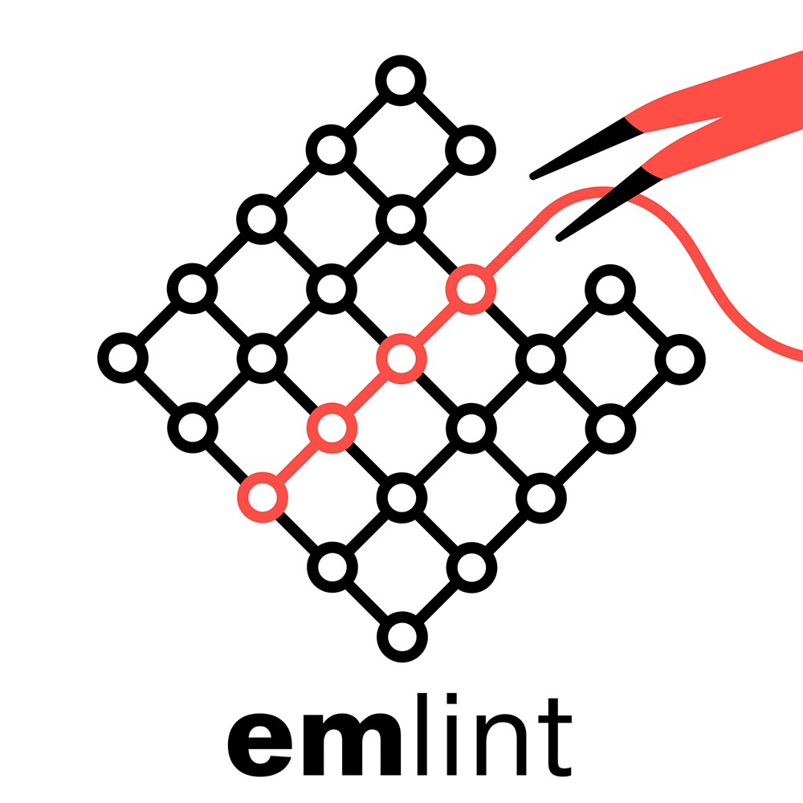

# emlint

<div align="center">
  
</div>

[](https://pypi.org/project/emlint/)

**stim simulates. sinter samples. emlint verifies.**

emlint is a static linter for [Stim](https://github.com/quantumlib/Stim)
Detector Error Models (DEMs). It finds structural problems before simulation.

> **v0.2 is preliminary.** The user-facing behavior is usable, but internal APIs
> and implementation details may change before v1.0.

## Quick start

Install emlint:

```bash
pip install emlint
```

Lint a DEM file or raw DEM text:

```bash
emlint check circuit.dem
emlint check 'error(0.01) D0 L0
detector D0'
```

A failing result includes a counter-example identifying the relevant mechanism,
detector, or observable. Select checks with `--only`/`--ignore`, or emit SARIF for
code-scanning tools:

```bash
emlint check circuit.dem --only detectability,sensitivity
emlint check circuit.dem --format sarif > emlint.sarif
```

Project defaults can be placed in `pyproject.toml` under `[tool.emlint]`. For
all command options, configuration examples, and exit codes, see the [CLI reference](docs/cli.md).

## Python

```python
import emlint
import stim

circuit = stim.Circuit.generated(
    "surface_code:rotated_memory_z",
    distance=3,
    rounds=3,
    after_clifford_depolarization=0.001,
)
report = emlint.check(circuit.detector_error_model())
print(emlint.format_text(report))
```

`emlint.check()` also accepts a raw DEM string or an explicit `pathlib.Path`.

## Documentation

| Guide | Use it for |
|---|---|
| [CLI reference](docs/cli.md) | Commands, options, output, and exit codes |
| [Check catalog](docs/checks.md) | What the six checks detect and how to interpret findings |

> **Note:** on DEMs produced with `decompose_errors=True`, the `duplicates`
> check (warning) may report mechanisms that share a detector signature after
> graphlike decomposition as "duplicates". This is expected decomposition
> output, not a concatenation bug. Use the `graphlike-decoder` profile context
> when a graphlike matcher is the intended decoder.
| [Debugging guide](docs/debugging.md) | Check-specific causes and investigation steps |
| [Formal grounding](docs/formal-grounding.md) | DEM vocabulary and formal properties |
| [v0.2 limitations](docs/limitations.md) | Scope, warnings, repeat blocks, and provisional behavior |

## CI

For a minimal GitHub Actions setup, install emlint and run it on changed DEM
files:

```yaml
- name: Install emlint
  run: pip install emlint
- name: Lint DEM files
  run: find . -name "*.dem" -print0 | xargs -0 -r -n1 emlint check
```

For local commits, the repository includes a pre-commit hook configuration:

```bash
pip install pre-commit
pre-commit install
```

The hook runs `emlint check --severity error` on staged `.dem` files. Warning-only
findings remain non-blocking; input failures still return exit code `3`.

## Contributing

See [CONTRIBUTING.md](CONTRIBUTING.md) for development setup, how to add a
check, test requirements, and quality gates.

## Acknowledgments

emlint is developed with AI assistance for scaffolding, test generation, red-teaming, and documentation. All design decisions, technical content, and final code are reviewed and owned by the
maintainers.

This project is funded by a [Mozilla Foundation](https://foundation.mozilla.org/)
fellowship and supported by the [Unitary Foundation](https://unitary.foundation/).

## License

Apache 2.0
